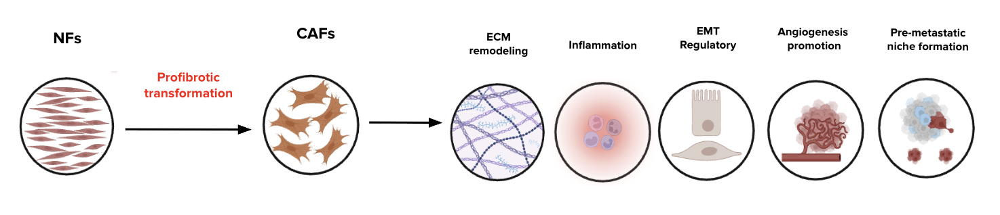
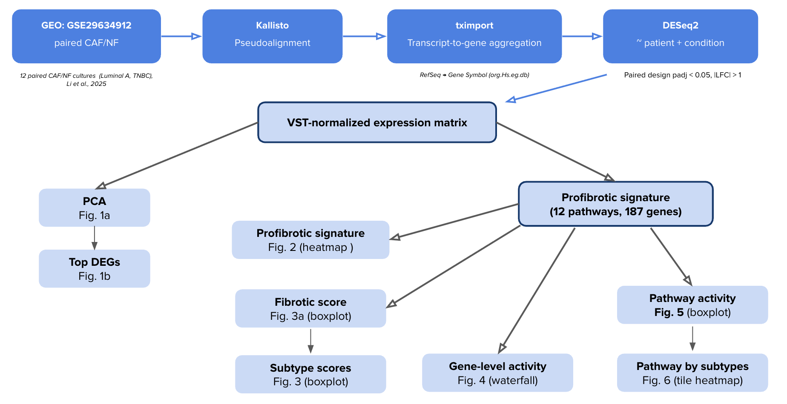
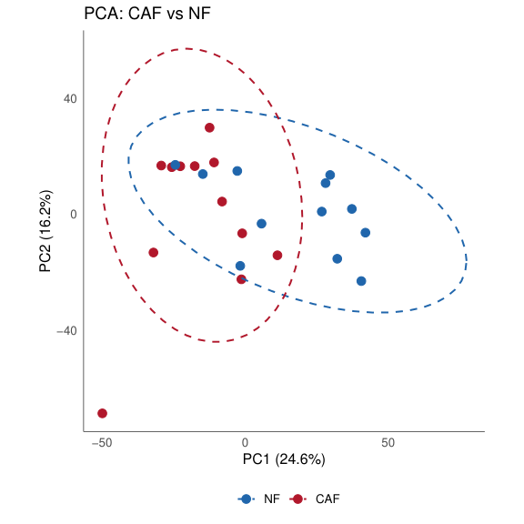
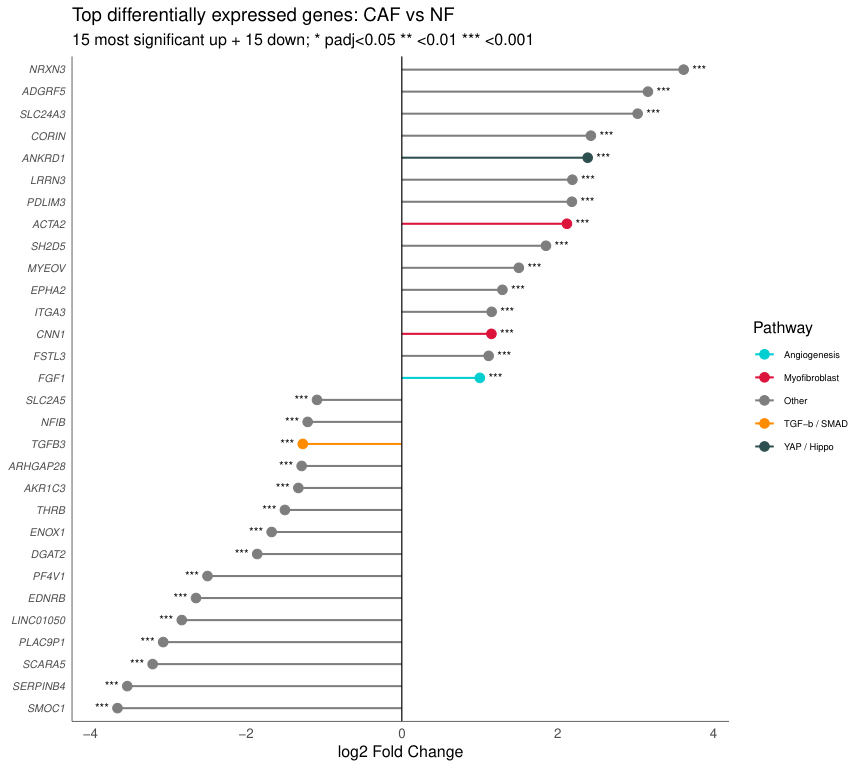
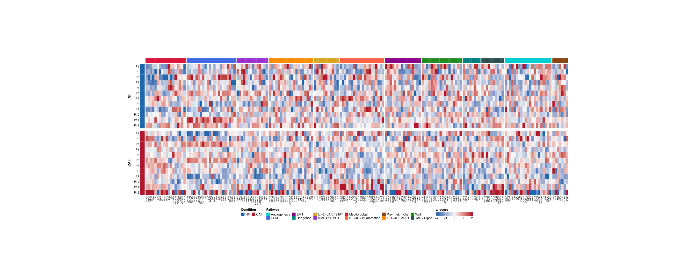
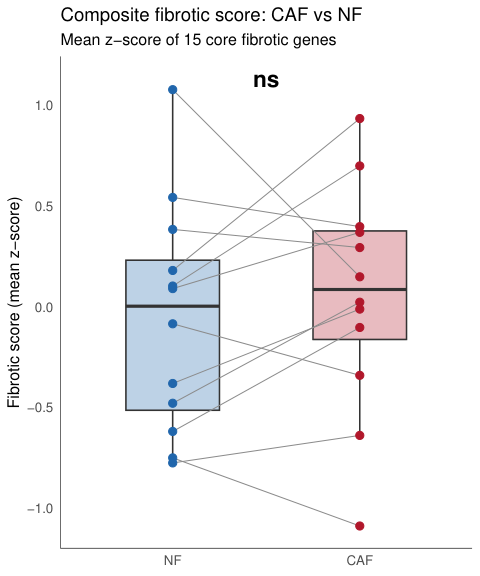
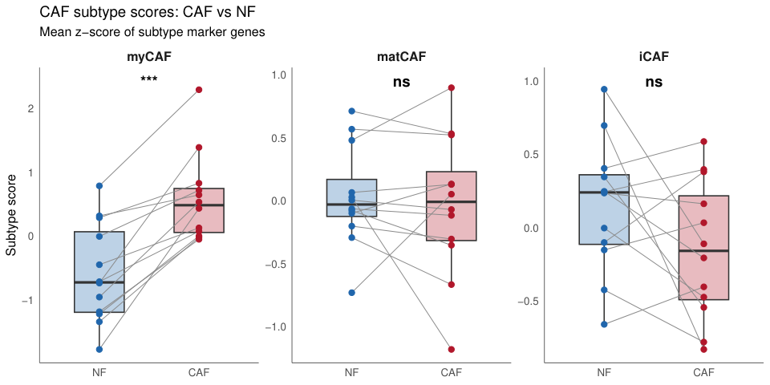
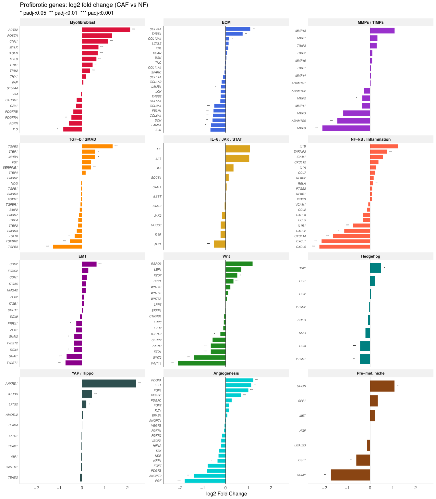
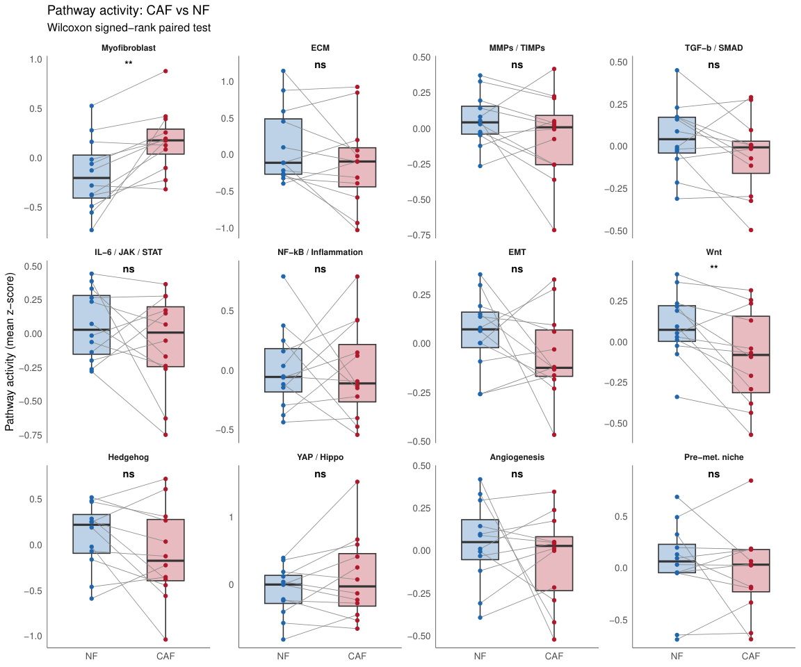
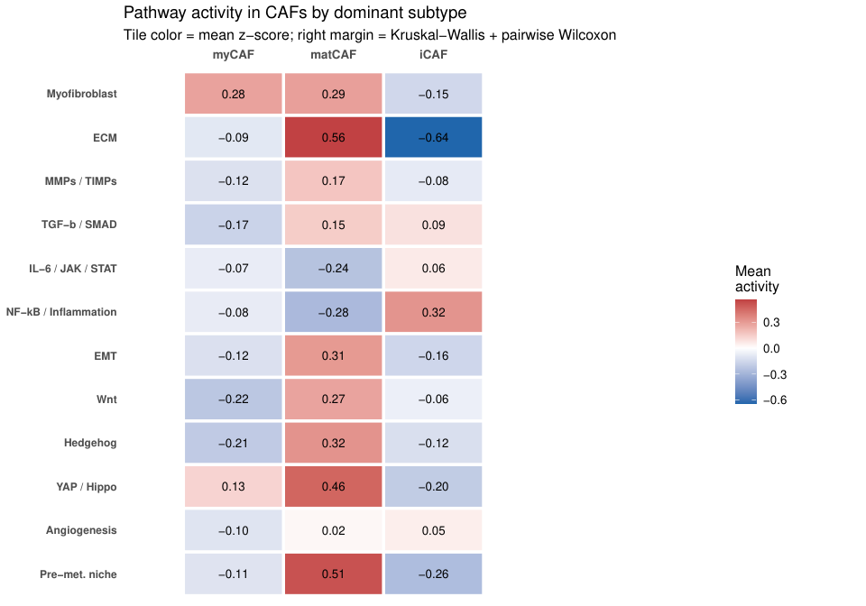

# Transcriptomic Analysis of Profibrotic Transformation in Breast Cancer–Associated Fibroblasts

**Student:** Pinova Alevtina | **Supervisor:** Sergey Vladimirov

<p align="center">
  
</p>

## Introduction

Cancer-associated fibroblasts (CAFs) are the main stromal cells in breast tumors. The transformation of normal fibroblasts (NFs) into CAFs involves profibrotic reprogramming: activation of TGF-β signaling, extracellular matrix remodeling, and collagen deposition. These changes promote tumor invasion, metastasis, and drug resistance. Single-cell studies have identified functional CAF subtypes — myCAF, matCAF, and iCAF — with different roles in matrix remodeling, inflammation, and cell interactions. However, the molecular basis of profibrotic NF-to-CAF transformation is not well understood.

## Aim and Objectives

**Aim:** To characterize the profibrotic transcriptional changes in breast CAFs compared to paired NFs.

**Objectives:**
1. Perform differential gene expression analysis between CAF and NF
2. Evaluate the profibrotic signature (12 pathways, 187 genes) and fibrotic markers
3. Assess signaling pathway activity and its association with CAF subtypes (myCAF, matCAF, iCAF)

## Data

| | |
|---|---|
| **Dataset** | [GSE296349](https://www.ncbi.nlm.nih.gov/geo/query/acc.cgi?acc=GSE296349) / [PRJNA1258964](https://www.ncbi.nlm.nih.gov/bioproject/PRJNA1258964) |
| **Source** | Li et al., 2025 [1] |
| **Samples** | 12 paired CAF/NF primary fibroblast cultures (Luminal A = 11, TNBC = 1) |
| **Platform** | Illumina HiSeq 4000, paired-end RNA-seq |

## Methods

<p align="center">
  
</p>

| Step | Tool | Details |
|------|------|---------|
| Download | `fasterq-dump` | Raw FASTQ from SRA |
| Pseudoalignment | `kallisto` ≥ 0.50 | NCBI RefSeq transcriptome, k=31, 100 bootstraps |
| Gene-level counts | `tximport` | RefSeq → gene symbol via `org.Hs.eg.db` |
| Differential expression | `DESeq2` | Paired design `~ patient + condition`, padj < 0.05, \|LFC\| > 1 |
| Subtype scoring | mean z-score | myCAF / matCAF / iCAF marker gene sets [3, 5] |

## Repository Structure

```
├── README.md
├── data/                          # kallisto abundance files (24 samples)
│   ├── P1_CAF_abundance.tsv
│   ├── P1_NF_abundance.tsv
│   └── ...
├── figures/                       
│   ├── caf_transformation.png
│   └── workflow.png
├── results/                       
│   ├── DE_results.csv
│   ├── Fig1a_PCA.png
│   ├── Fig1b_top_DEGs.png
│   ├── Fig2_heatmap.png
│   ├── Fig3a_fibrotic_score.png
│   ├── Fig3b_subtype_scores.png
│   ├── Fig4_waterfall.png
│   ├── Fig5_pathway_activity.png
│   └── Fig6_pathway_by_subtype.png
└── scripts/
    └── Analysis.R
```

## Results

### 1. Transcriptomic separation of CAF and NF

PCA shows a partial but reproducible separation of CAF and NF along PC1 (Fig. 1a). The confidence ellipses overlap, which means there is significant variability between patients. Among the top upregulated genes, contractile myofibroblast markers (ACTA2, TAGLN, MYL9) dominate, while the downregulated genes include Wnt pathway components (Fig. 1b). Most of the top DEGs belong to specific profibrotic pathways.

<p align="center">
  
  
</p>

### 2. Profibrotic signature heatmap

The heatmap of 187 genes across 12 pathways shows a clear contrast between NF and CAF in the Myofibroblast cluster (ACTA2, TAGLN, CNN1, FAP are activated) and the Wnt cluster (WNT5A, SFRP1, SFRP2, DKK1 are suppressed). The ECM, TGF-β, and NF-κB pathways show a heterogeneous pattern — some genes go up and others go down. This means that profibrotic transformation is selective, not global.

<p align="center">
  
</p>

### 3. Fibrotic score and CAF subtypes

The global composite fibrotic score (16 genes) did not differ significantly between CAF and NF (Fig. 3a). However, subtype analysis shows a different picture: the **myCAF** score is significantly elevated in CAFs, while matCAF and iCAF scores remain unchanged (Fig. 3b). The opposing subtype programs compensate each other and mask the overall differences.

<p align="center">
  
  
</p>

### 4. Gene-level activity within pathways

The waterfall plot shows log2FC for each gene in the profibrotic signature. The Myofibroblast pathway has unidirectional activation. The Wnt pathway shows coordinated but opposite dynamics. ECM, TGF-β/SMAD, and NF-κB pathways have a mixed pattern with both elevated and decreased genes.

<p align="center">
  
</p>

### 5. Pathway activity

Of the 12 profibrotic pathways, only two reach significance in paired Wilcoxon test: Myofibroblast (increased) and Wnt (decreased). The remaining ten pathways do not show significant differences. Profibrotic transformation is not a total activation of the fibrotic program but is limited to two contrasting axes.

<p align="center">
  
</p>

### 6. Pathway activity by CAF subtypes

CAF subtypes form clearly different profibrotic profiles. myCAF-dominant samples show the strongest contractile activation and Wnt suppression. matCAF-dominant samples retain elevated ECM and TGF-β activity. iCAF-dominant samples show increased IL-6/JAK/STAT and NF-κB activity.

<p align="center">
  
</p>

## Conclusions

1. Profibrotic CAF transformation in breast cancer is driven primarily by the myofibroblastic program (ACTA2, TAGLN, MYL9) with concurrent Wnt suppression
2. The global fibrotic score does not differ between CAF and NF because opposing subtype programs mask each other
3. Distinct CAF subtypes (myCAF, matCAF, iCAF) coexist within the cohort with different pathway activation profiles
4. Profibrotic transformation is selective — it remodels specific matrix components rather than activating the entire fibrotic program

**System requirements:** R ≥ 4.3, ≥ 16 GB RAM

**R packages:** DESeq2, tximport, ggplot2, ComplexHeatmap, org.Hs.eg.db, AnnotationDbi, circlize, dplyr, tidyr, ggrepel

## References

1. Li S., Patel M., Engstrom M. et al. Deciphering Functional Heterogeneity of Cancer-Associated Fibroblasts Across Molecular Subtypes of Breast Cancer. *bioRxiv*, 2025. DOI: [10.1101/2025.01.05.631269](https://doi.org/10.1101/2025.01.05.631269)
2. Cao Z., Quazi S.A., Oselame L. et al. Cancer-associated fibroblasts as therapeutic targets for cancer. *J Biomed Sci*, 2025, 32:7. DOI: [10.1186/s12929-024-01099-2](https://doi.org/10.1186/s12929-024-01099-2)
3. Kieffer Y., Hocber J.E., Jez G. et al. Single-Cell Analysis Reveals Fibroblast Clusters Linked to Immunotherapy Resistance in Cancer. *Cancer Discov*, 2020, 10(9):1330–1351. DOI: [10.1158/2159-8290.CD-19-1384](https://doi.org/10.1158/2159-8290.CD-19-1384)
4. Pelon F., Bourachot B., Kieffer Y. et al. Deciphering the spatial landscape and plasticity of immunosuppressive fibroblasts in breast cancer. *Nat Commun*, 2024, 15:2806. DOI: [10.1038/s41467-024-47068-z](https://doi.org/10.1038/s41467-024-47068-z)
5. Ning L., Quan C., Wang Y. et al. scRNA-seq characterizing the heterogeneity of fibroblasts in breast cancer reveals a novel subtype SFRP4+ CAF. *Front Oncol*, 2024, 14:1348299. DOI: [10.3389/fonc.2024.1348299](https://doi.org/10.3389/fonc.2024.1348299)
6. Naito Y., Nakanishi Y. How Do Cancer Cells Create Cancer-Associated Fibroblast Subtypes? *Cancer Sci*, 2025. DOI: [10.1111/cas.70133](https://doi.org/10.1111/cas.70133)
7. Xia Z., Vermeulen S., Suwal U. et al. Cancer-associated fibroblasts mediate resistance to neoadjuvant therapy in breast cancer. *Clin Transl Med*, 2024, 14:e1779. DOI: [10.1002/ctm2.1779](https://doi.org/10.1002/ctm2.1779)
